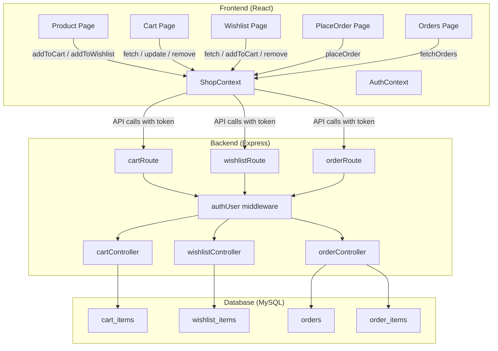

# Full-Stack API Integration: Cart, Wishlist, Orders

## Current State Analysis

The app currently has a **split architecture problem**: the backend only serves product data, while cart/wishlist/orders are handled entirely in-memory (cart) or localStorage (wishlist) on the frontend. This means:
- Cart data is lost on refresh
- Wishlist data is per-browser, not per-user
- Orders don't actually persist anywhere
- There's no server-side validation of cart/wishlist operations

We're going to close this gap by building backend APIs and wiring them into the existing frontend.

---

## Schema Status

✅ `order_number` and `payment_status` columns already dropped from live database. We'll just update `schema.sql` to reflect reality.

---

## Proposed Changes

### Overview Diagram



---

## PART 1 — Backend APIs

### Phase 1A: Schema Cleanup & Middleware Fix

#### [MODIFY] [schema.sql](file:///c:/Users/DCL/Desktop/BrainStation%2023/E-Commerce%20Project/project/backend/config/schema.sql)

- Remove the `order_number` and `payment_status` lines from the `orders` table definition (already dropped in live DB — this just keeps the file accurate)
- Add a `UNIQUE` constraint on `cart_items(user_id, product_id, size)` to prevent duplicate cart entries at the DB level
- Add a `UNIQUE` constraint on `wishlist_items(user_id, product_id)` to prevent duplicate wishlist entries

```sql
-- Run against live database:
ALTER TABLE cart_items ADD UNIQUE KEY unique_cart_entry (user_id, product_id, size);
ALTER TABLE wishlist_items ADD UNIQUE KEY unique_wishlist_entry (user_id, product_id);
```

> [!NOTE]
> **Pattern: Defense in Depth.** We enforce uniqueness at *both* the application layer (controller logic) and the database layer (UNIQUE constraint). If a race condition sneaks past the app code, the DB catches it.

#### [MODIFY] [auth.js](file:///c:/Users/DCL/Desktop/BrainStation%2023/E-Commerce%20Project/project/backend/middleware/auth.js)

**The Problem:** Currently the middleware stuffs `userId` into `req.body`:
```javascript
if (!req.body) req.body = {};
req.body.userId = decoded.id;
```

This mixes up *who the client is* (server-determined identity) with *what the client sent* (request payload). It also requires a hack to create a fake body for GET requests.

**The Fix:** Use the standard Express convention — attach to the request object directly:

```diff
- if (!req.body) req.body = {};
- req.body.userId = decoded.id;
+ req.userId = decoded.id;
```

Apply this same fix in both `authUser` and `authAdmin`.

> [!WARNING]
> **Breaking change:** After this fix, the existing `verifyToken` controller in `userController.js` doesn't use `req.body.userId`, so it's unaffected. But if any future code was reading `req.body.userId`, it would need to use `req.userId` instead.

---

### Phase 1B: Cart APIs

#### [NEW] [cartController.js](file:///c:/Users/DCL/Desktop/BrainStation%2023/E-Commerce%20Project/project/backend/controllers/cartController.js)

Four controller functions, all requiring `authUser` middleware (userId comes from `req.userId`):

| Function | Method | Route | Description |
|---|---|---|---|
| `getCart` | GET | `/api/cart/` | Fetch all cart items for the logged-in user. JOINs with `products` and `product_images` to return full product details (name, price, image). |
| `addToCart` | POST | `/api/cart/add` | **Upsert pattern**: If `(user_id, product_id, size)` already exists → increment `quantity` by the sent amount. Otherwise → INSERT new row. Request body: `{ productId, size, quantity }` |
| `updateCartItem` | PUT | `/api/cart/update` | Set the quantity to an exact value. Request body: `{ productId, size, quantity }`. If `quantity <= 0`, delete the row instead. |
| `removeFromCart` | DELETE | `/api/cart/remove` | Delete a specific `(user_id, product_id, size)` entry. Request body: `{ productId, size }` |

**SQL for `addToCart` (Upsert Pattern):**
```sql
-- MySQL's INSERT...ON DUPLICATE KEY UPDATE
-- Requires the UNIQUE constraint from Phase 1A
INSERT INTO cart_items (user_id, product_id, size, quantity)
VALUES (?, ?, ?, ?)
ON DUPLICATE KEY UPDATE quantity = quantity + VALUES(quantity);
```

**SQL for `getCart` (Data Stitching via JOIN):**
```sql
SELECT 
    ci.id, ci.product_id, ci.size, ci.quantity,
    p.name, p.price,
    (SELECT image_url FROM product_images WHERE product_id = p.id LIMIT 1) AS image
FROM cart_items ci
JOIN products p ON ci.product_id = p.id
WHERE ci.user_id = ?;
```

> [!NOTE]
> **Pattern: Upsert (INSERT...ON DUPLICATE KEY UPDATE).** This is the idiomatic MySQL way to "insert if new, update if exists" in a single atomic query. No need for a SELECT-then-INSERT race condition.

> [!NOTE]
> **Design Decision: Backend for Frontend (BFF).** `getCart` returns full product details (name, price, image) via JOIN so the frontend doesn't need to make separate product API calls for each cart item.

#### [NEW] [cartRoute.js](file:///c:/Users/DCL/Desktop/BrainStation%2023/E-Commerce%20Project/project/backend/routes/cartRoute.js)

```
GET    /api/cart/        → authUser → getCart
POST   /api/cart/add     → authUser → addToCart
PUT    /api/cart/update  → authUser → updateCartItem
DELETE /api/cart/remove  → authUser → removeFromCart
```

#### [MODIFY] [server.js](file:///c:/Users/DCL/Desktop/BrainStation%2023/E-Commerce%20Project/project/backend/server.js)

- Import and mount `cartRouter` at `/api/cart`

---

### Phase 1C: Wishlist APIs

#### [NEW] [wishlistController.js](file:///c:/Users/DCL/Desktop/BrainStation%2023/E-Commerce%20Project/project/backend/controllers/wishlistController.js)

Three controller functions:

| Function | Method | Route | Description |
|---|---|---|---|
| `getWishlist` | GET | `/api/wishlist/` | Fetch all wishlist items for user. JOINs with `products` and `product_images`. Also fetches **sizes** for each product (needed for the size selector in the wishlist "Add to Cart" feature). |
| `addToWishlist` | POST | `/api/wishlist/add` | INSERT into wishlist_items. Uses `INSERT IGNORE` to silently skip duplicates (thanks to UNIQUE constraint). Request body: `{ productId }` |
| `removeFromWishlist` | DELETE | `/api/wishlist/remove` | DELETE from wishlist_items. Request body: `{ productId }` |

**SQL for `getWishlist` (with sizes stitching):**
```sql
-- Query 1: Get wishlist items with product details
SELECT 
    wi.id, wi.product_id,
    p.name, p.price, p.description, p.category, p.sub_category,
    (SELECT image_url FROM product_images WHERE product_id = p.id LIMIT 1) AS image
FROM wishlist_items wi
JOIN products p ON wi.product_id = p.id
WHERE wi.user_id = ?;

-- Query 2: For each product, fetch its sizes
SELECT product_id, size FROM product_sizes 
WHERE product_id IN (?, ?, ...);
-- Then stitch: product.sizes = sizeRows.filter(r => r.product_id === product.product_id).map(r => r.size)
```

> [!NOTE]
> **Data Stitching Pattern** (same as `getProductById`): We run two queries and merge in JS, rather than a complex JOIN that would create cartesian explosion with multiple sizes per product.

#### [NEW] [wishlistRoute.js](file:///c:/Users/DCL/Desktop/BrainStation%2023/E-Commerce%20Project/project/backend/routes/wishlistRoute.js)

```
GET    /api/wishlist/        → authUser → getWishlist
POST   /api/wishlist/add     → authUser → addToWishlist
DELETE /api/wishlist/remove  → authUser → removeFromWishlist
```

#### [MODIFY] [server.js](file:///c:/Users/DCL/Desktop/BrainStation%2023/E-Commerce%20Project/project/backend/server.js)

- Import and mount `wishlistRouter` at `/api/wishlist`

---

### Phase 1D: Order APIs

#### [NEW] [orderController.js](file:///c:/Users/DCL/Desktop/BrainStation%2023/E-Commerce%20Project/project/backend/controllers/orderController.js)

Two controller functions:

| Function | Method | Route | Description |
|---|---|---|---|
| `placeOrder` | POST | `/api/order/place` | **Transaction-based.** Inserts into `orders`, then `order_items`, then deletes all `cart_items` for that user. All within a single MySQL transaction so it's all-or-nothing. Request body: `{ shippingAddress, paymentMethod, totalAmount }` |
| `getUserOrders` | GET | `/api/order/` | Fetch all orders for the user, with their order_items joined with product details. Returns newest first. |

**`placeOrder` Transaction Flow:**
```
BEGIN TRANSACTION
  1. INSERT INTO orders (user_id, total_amount, payment_method, shipping_address)
  2. Get the new order_id from insertId
  3. SELECT all cart_items for user (with product prices from products table)
  4. INSERT each cart item into order_items (snapshot the price at time of order)
  5. DELETE FROM cart_items WHERE user_id = ?
COMMIT
```

> [!NOTE]
> **Pattern: Database Transaction.** We use `connection.beginTransaction()` to ensure atomicity. If the order_items insert fails, the order is rolled back. If cart deletion fails, everything is rolled back. The user never ends up in a half-state.

> [!TIP]
> **Why snapshot the price?** We copy the current `product.price` into `order_items.price` at order time. If the product price changes later, the order history still shows what the user actually paid.

**`getUserOrders` Response Shape:**
```json
{
  "success": true,
  "orders": [
    {
      "id": 1,
      "total_amount": 150.00,
      "status": "Pending",
      "payment_method": "cod",
      "shipping_address": "John Doe, 123 Main St, ...",
      "created_at": "2026-04-24T...",
      "items": [
        {
          "product_id": 5,
          "name": "Classic T-Shirt",
          "size": "M",
          "quantity": 2,
          "price": 25.00,
          "image": "/assets/p_img5.png"
        }
      ]
    }
  ]
}
```

#### [NEW] [orderRoute.js](file:///c:/Users/DCL/Desktop/BrainStation%2023/E-Commerce%20Project/project/backend/routes/orderRoute.js)

```
POST /api/order/place  → authUser → placeOrder
GET  /api/order/       → authUser → getUserOrders
```

#### [MODIFY] [server.js](file:///c:/Users/DCL/Desktop/BrainStation%2023/E-Commerce%20Project/project/backend/server.js)

- Import and mount `orderRouter` at `/api/order`

---

## PART 2 — Frontend Refactoring

### Phase 2A: ShopContext — The Big Refactor

#### [MODIFY] [ShopContext.jsx](file:///c:/Users/DCL/Desktop/BrainStation%2023/E-Commerce%20Project/project/frontend/src/context/ShopContext.jsx)

This is the most complex change. The context goes from **local-only** to **API-backed**.

**Cart Changes:**

| Current Behavior | New Behavior |
|---|---|
| `addToCart()` — updates in-memory array | `addToCart()` — POST `/api/cart/add`, then re-fetch cart |
| `removeFromCart()` — filters in-memory array | `removeFromCart()` — DELETE `/api/cart/remove`, then re-fetch cart |
| `updateCartItemQuantity()` — updates in-memory | `updateCartItemQuantity()` — PUT `/api/cart/update`, then re-fetch cart |
| `clearCart()` — sets empty array | `clearCart()` — only called after `placeOrder` (backend handles deletion) |
| Cart lost on refresh | Cart persisted in DB, fetched on login |

**New function: `fetchCart()`**
- Calls GET `/api/cart/` with the token
- Normalizes response: maps `product_id` → `_id`, wraps `image` into `[image]` array
- Sets `cartItems` state with server data
- Called on mount (when `token` exists) and after every cart mutation

**Wishlist Changes:**

| Current Behavior | New Behavior |
|---|---|
| Stored in localStorage | Stored in DB via API |
| `addToWishlist()` — adds to local array | `addToWishlist()` — POST `/api/wishlist/add`, then re-fetch |
| `removeFromWishlist()` — filters local array | `removeFromWishlist()` — DELETE `/api/wishlist/remove`, then re-fetch |
| `isInWishlist()` — checks local array | `isInWishlist()` — checks server-synced `wishlistItems` array (same logic, different data source) |
| No login check | Login required (like cart) |
| localStorage sync useEffect | **Removed** — no more localStorage for wishlist |

**New function: `fetchWishlist()`**
- Calls GET `/api/wishlist/` with the token
- Normalizes response: maps `product_id` → `_id`, `sub_category` → `subCategory`, wraps `image` into `[image]` array
- **Includes `sizes` array** for each product (from stitched query)
- Sets `wishlistItems` state with server data
- Called on mount (when `token` exists) and after every wishlist mutation

**New function: `placeOrder(shippingAddress, paymentMethod, totalAmount)`**
- Calls POST `/api/order/place` with the token
- On success: clears local `cartItems` state (backend already deleted from DB)
- Returns success/failure for the PlaceOrder page to handle

**New function: `fetchOrders()`**
- Calls GET `/api/order/` with the token
- Returns the orders array for the Orders page

**Mount behavior: `useEffect` on token change**
```javascript
useEffect(() => {
    if (token) {
        fetchCart();
        fetchWishlist();
    } else {
        // User logged out — clear local state
        setCartItems([]);
        setWishlistItems([]);
    }
}, [token]);
```

> [!NOTE]
> **Pattern: Pessimistic Updates.** We call the API first, then re-fetch the full cart/wishlist. This is simpler and guarantees the frontend always mirrors the database. The tradeoff is a slight delay after each action. Optimistic updates (update UI immediately, roll back on error) are faster but more complex — good to learn pessimistic first.

---

### Phase 2B: Product Page

#### [MODIFY] [Product.jsx](file:///c:/Users/DCL/Desktop/BrainStation%2023/E-Commerce%20Project/project/frontend/src/pages/Product.jsx)

- **`handleAddToWishlist`**: Add `isUserVerified` check (same pattern as `handleAddToCart` on line 71)

```diff
  const handleAddToWishlist = () => {
+   if (!isUserVerified) {
+     toast.error("Please log in first");
+     return;
+   }
    if (!product) return;
    if (isInWishlist(product._id)) {
      toast.info('Already in wishlist', { autoClose: 1500 });
      return;
    }
    addToWishlist(product);
-   toast.success('Added to wishlist', { autoClose: 1500 });
+   // toast moved inside the ShopContext addToWishlist function
  }
```

- No other JSX changes — the wishlist button already reads `isInWishlist()` which will now check server-synced data

---

### Phase 2C: Cart Page

#### [MODIFY] [Cart.jsx](file:///c:/Users/DCL/Desktop/BrainStation%2023/E-Commerce%20Project/project/frontend/src/pages/Cart.jsx)

- Minimal changes — the Cart page already reads from `ShopContext`
- `updateCartItemQuantity`, `removeFromCart` functions are now API-backed (changed in ShopContext)
- Image rendering: currently `item.image?.[0]` — we'll normalize in ShopContext's `fetchCart` to keep `image` as `[imageString]` array for backward compatibility so no JSX changes needed here

---

### Phase 2D: PlaceOrder Page

#### [MODIFY] [PlaceOrder.jsx](file:///c:/Users/DCL/Desktop/BrainStation%2023/E-Commerce%20Project/project/frontend/src/pages/PlaceOrder.jsx)

```diff
- const { cartItems, currency, delivery_fee, cartSubtotal, clearCart } = useContext(ShopContext)
+ const { cartItems, currency, delivery_fee, cartSubtotal, placeOrder } = useContext(ShopContext)

- const handleSubmit = (e) => {
+ const handleSubmit = async (e) => {
    e.preventDefault()
    // ...existing validation stays the same...
    
-   // Simulate order placement (no backend yet)
-   clearCart()
-   toast.success('Order placed successfully!')
-   navigate('/orders')
+   const shippingAddress = `${formData.firstName} ${formData.lastName}, ${formData.street}, ${formData.city}, ${formData.state} ${formData.zipcode}, ${formData.country}. Phone: ${formData.phone}`
+   const result = await placeOrder(shippingAddress, method, total)
+   if (result.success) {
+     toast.success('Order placed successfully!')
+     navigate('/orders')
+   } else {
+     toast.error(result.message || 'Failed to place order')
+   }
  }
```

---

### Phase 2E: Wishlist Page — Size Selector Feature

#### [MODIFY] [WishList.jsx](file:///c:/Users/DCL/Desktop/BrainStation%2023/E-Commerce%20Project/project/frontend/src/pages/WishList.jsx)

This is where we add the **new size selector feature**. When the user clicks "Add to Cart" on a wishlist item, they can choose a size first.

**New UI behavior:**
- Each wishlist item card now shows **size buttons** (same style as the Product page size selector)
- User selects a size → the selected size is tracked in local component state
- "ADD TO CART" button sends the selected size to `addToCart(product, selectedSize)`
- If no size is selected and sizes exist, default to the first available size

**Implementation approach:**
- Add local state: `const [selectedSizes, setSelectedSizes] = useState({})` — keyed by `product._id`
- Render size buttons within each wishlist item card (between price and action buttons)
- Pass selected size to `handleAddToCart`

```jsx
{/* Size Selector — inside each wishlist item card */}
{item.sizes && item.sizes.length > 0 && (
  <div className='flex gap-2 mt-3'>
    {item.sizes.map((size) => (
      <button
        key={size}
        onClick={() => setSelectedSizes(prev => ({ ...prev, [item._id]: size }))}
        className={`px-3 py-1 border rounded text-sm ${
          selectedSizes[item._id] === size
            ? 'border-black bg-black text-white'
            : 'border-gray-300 hover:border-gray-400'
        }`}
      >
        {size}
      </button>
    ))}
  </div>
)}
```

- `handleAddToCart` updated:
```diff
  const handleAddToCart = (product) => {
-   addToCart(product)
+   const size = selectedSizes[product._id] || product.sizes?.[0] || null;
+   addToCart(product, size, 1)
    toast.success('Added to cart')
    removeFromWishlist(product._id)
  }
```

---

### Phase 2F: Orders Page — Full Build

#### [MODIFY] [Orders.jsx](file:///c:/Users/DCL/Desktop/BrainStation%2023/E-Commerce%20Project/project/frontend/src/pages/Orders.jsx)

Build out the full Orders page **matching the existing project UI theme** (same title style, borders, spacing as Cart/Wishlist pages).

**Layout:**
- Title section: "Your **Orders**" with the horizontal line separator (same pattern as Cart/Wishlist pages)
- Each order rendered as a bordered card showing:
  - Order date (formatted) + Status badge (color-coded)
  - Payment method + Total amount
  - Shipping address
  - Expandable item list showing: product image, name, size, qty, unit price
- Empty state: "No orders yet" with a "Browse Collection" link

**Status color scheme (consistent with project's minimal black/white/gray theme):**
- `Pending` → yellow/amber badge
- `Processing` → blue badge
- `Shipped` → purple badge
- `Delivered` → green badge
- `Cancelled` → red badge

**Data flow:**
- On mount: calls `fetchOrders()` from ShopContext
- Displays loading spinner while fetching (same spinner pattern as Product page)

---

## File Change Summary

| File | Action | Phase |
|---|---|---|
| `backend/config/schema.sql` | MODIFY | 1A |
| `backend/middleware/auth.js` | MODIFY | 1A |
| `backend/controllers/cartController.js` | NEW | 1B |
| `backend/routes/cartRoute.js` | NEW | 1B |
| `backend/controllers/wishlistController.js` | NEW | 1C |
| `backend/routes/wishlistRoute.js` | NEW | 1C |
| `backend/controllers/orderController.js` | NEW | 1D |
| `backend/routes/orderRoute.js` | NEW | 1D |
| `backend/server.js` | MODIFY | 1B–1D |
| `frontend/src/context/ShopContext.jsx` | MODIFY | 2A |
| `frontend/src/pages/Product.jsx` | MODIFY | 2B |
| `frontend/src/pages/Cart.jsx` | MODIFY | 2C |
| `frontend/src/pages/PlaceOrder.jsx` | MODIFY | 2D |
| `frontend/src/pages/WishList.jsx` | MODIFY | 2E |
| `frontend/src/pages/Orders.jsx` | MODIFY | 2F |

---

## Execution Order

We'll implement in this exact sequence, testing each phase before moving on:

```
Phase 1A → Schema cleanup + middleware fix (prerequisite for everything)
Phase 1B → Cart APIs (test with browser/curl)
Phase 1C → Wishlist APIs (test with browser/curl)
Phase 1D → Order APIs (test with browser/curl)
Phase 2A → ShopContext refactor (the bridge between backend and frontend)
Phase 2B → Product page (login check for wishlist)
Phase 2C → Cart page (verify API integration)
Phase 2D → PlaceOrder page (wire up order API)
Phase 2E → Wishlist page (size selector + API integration)
Phase 2F → Orders page (build from scratch)
```

---

## Verification Plan

### After Each Backend Phase (1B, 1C, 1D)
- Test each endpoint manually via browser/curl with a valid JWT token
- Test auth rejection (no token, invalid token)
- Test edge cases (add same item twice, remove non-existent item)

### After Frontend Integration (Phase 2A-2F)
- Full user flow test via browser:
  1. Login → verify cart/wishlist loads from DB
  2. Product page → Add to Cart (logged in & logged out)
  3. Product page → Add to Wishlist (logged in & logged out)
  4. Cart page → increment, decrement, remove
  5. Cart page → Proceed to Checkout
  6. PlaceOrder page → fill form, place order
  7. Orders page → verify order appears with correct items
  8. Wishlist page → Select size → Add to Cart (moves item), Remove
  9. Logout → verify cart/wishlist clears locally
  10. Login again → verify cart/wishlist persists from DB
